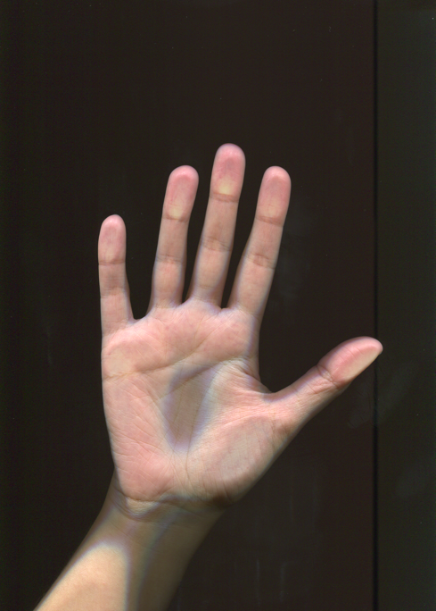
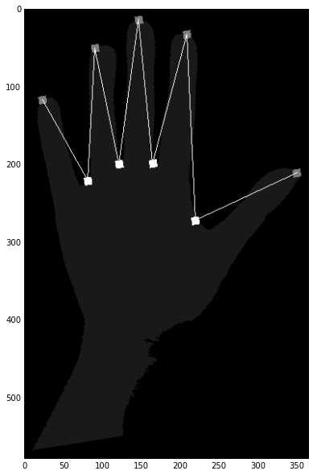

## Hands features extractor

This project is concentrated around hands photographs or scans with black background (see *data/* folder). Completed as part of Image processing and analysis course, CMC Lomonosov MSU. Python 2.7 and OpenCV, Scikit-image libraries were used for image analysis.

The project contains:
* input data (hands scans), 
* **scripts/imhandle.py** -- Python module for basic image I/O operations,
* **scripts/hands_handle.py** -- Python module for specific hands images analysis,
* **scripts/Report - IPython Notebook** - experiments report with pictures and tables (IPython Notebook, in Russian)
* **scripts/Report - HTML** - experiments report with pictures and tables (HTML, in Russian)

In scripts/hands_handle.py you can find fingertips and valleys extraction procedure, features extraction procedure. In reports files you can find explanations and step-by-step images in Russian.
